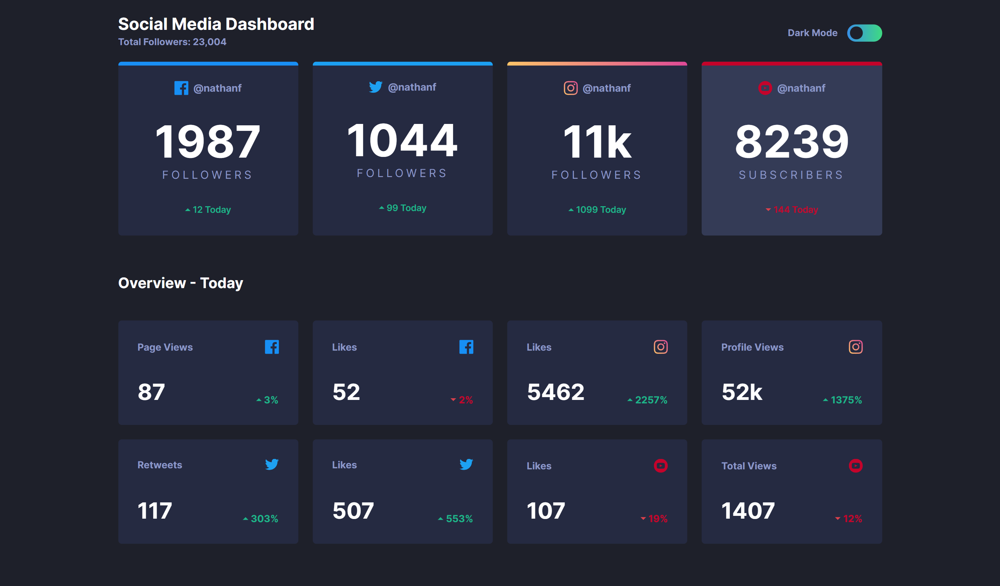

# Frontend Mentor - Social media dashboard with theme switcher solution

This is a solution to the [Social media dashboard with theme switcher challenge on Frontend Mentor](https://www.frontendmentor.io/challenges/social-media-dashboard-with-theme-switcher-6oY8ozp_H). Frontend Mentor challenges help you improve your coding skills by building realistic projects. 

### Screenshot

## My process

- Started with the mobile view of the project then worked my way through the tablet then desktop. This was the project where I learned simple organizing like creating different css files and importing it in the main file.

### Built with

- Semantic HTML5 markup
- CSS 
- CSS Grid
- Mobile-first workflow

## Author

- Github - [Seigfred Sayson](https://github.com/seigfred0)

## Acknowledgments

- FrontEnd Mentor
